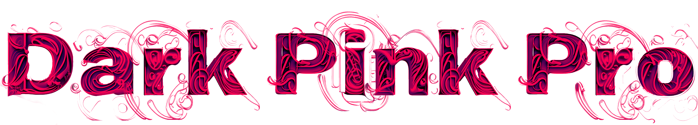
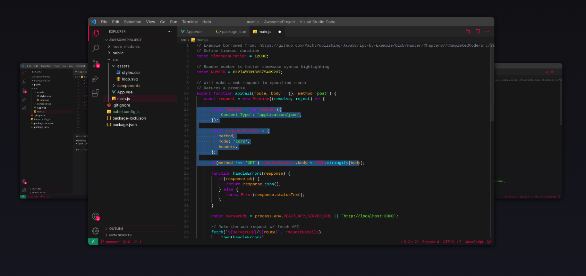
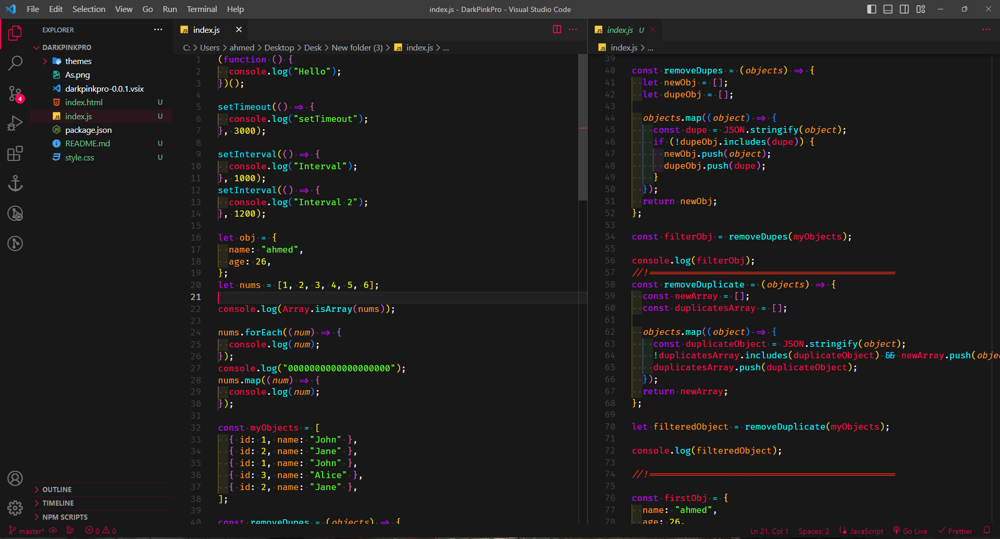
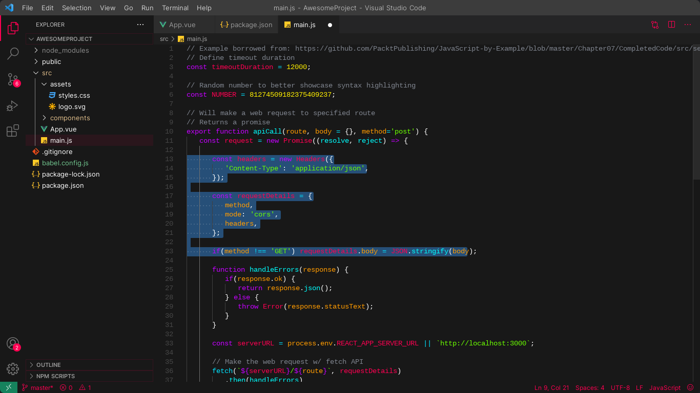
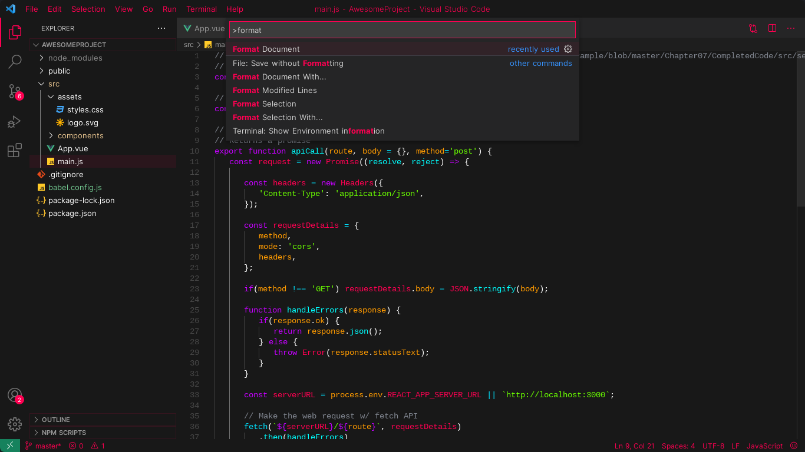
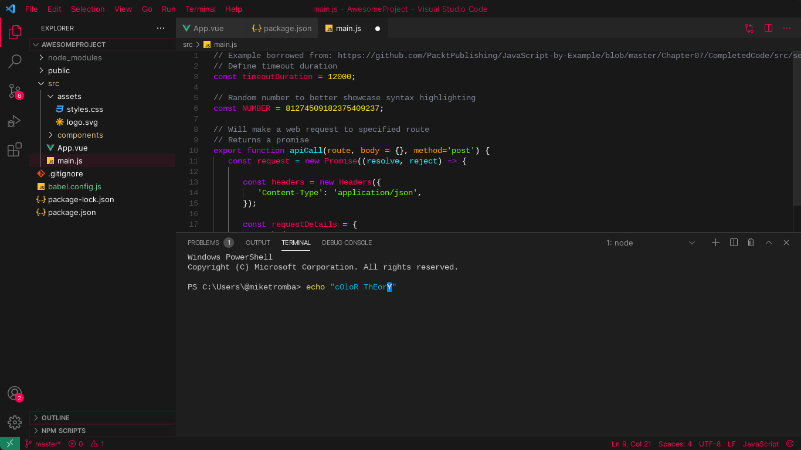

  

<h1 align="center">Dark Pink Pro</h1>

---

<h2 align="center"> DARK Theme With Pink Accents And Vibrant Colors
     
</h2>

 

## 💖 Screenshots 

## ✍️ Authors 

- [@AhmedSaid](https://github.com/AhmeddSaid) - Idea & Initial work

## 🎉 Acknowledgements 

- Hat tip to anyone whose code was used
- Inspiration
- References
